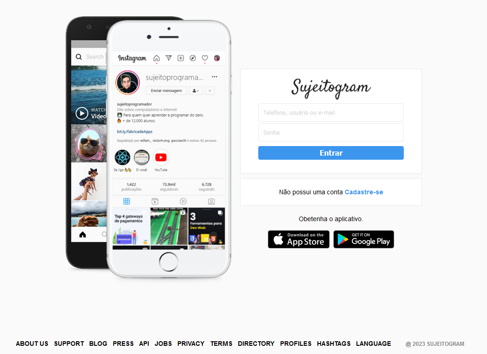
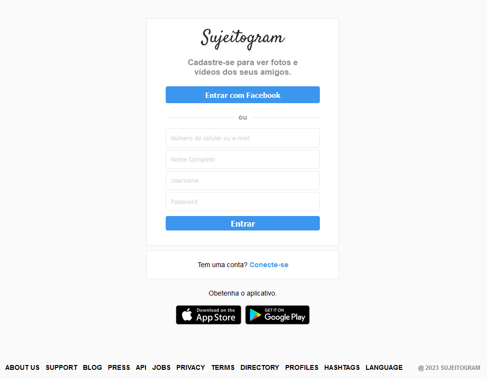

<h1 align="center"> Clone do Instagram </h1>

##  Tecnologias

Esse projeto foi desenvolvido com as seguintes tecnologias:

- HTML 
- CSS

## Projeto

Desenvolvido apartir dos etudos da formação <a href="https://sujeitoprogramador.com/fullstackpro/" target=_blank>FullStack - Sujeito programador</a>  
Onde foi realizado o clone das páginas de login e de cadastro da rede social Instagram

- [Acesse o projeto finalizado, online]()

## Layout

</a>
</a>
